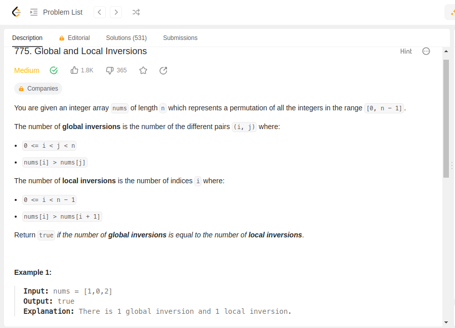
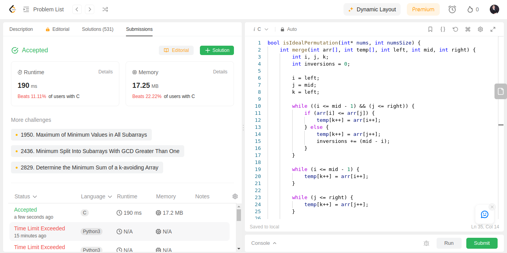
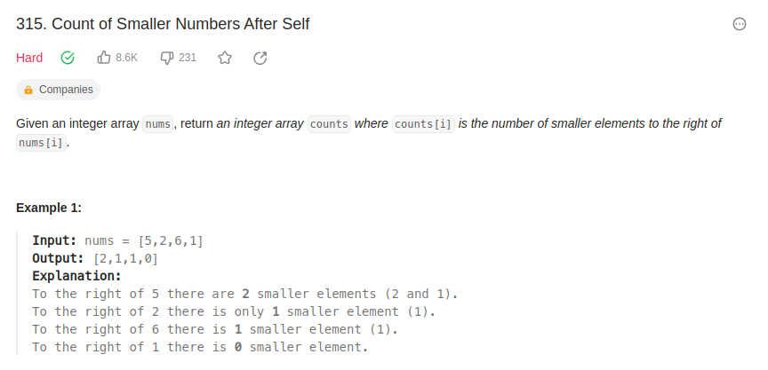
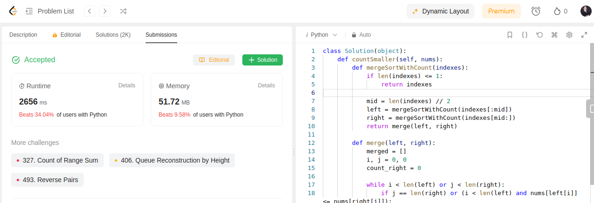

**Conteúdo da Disciplina**: D-C<br>

## Alunos
|Matrícula | Aluno |
| -- | -- |
| 20/0025449  |  Natan Tavares Santana |
| 20/0036351  |  Clara Marcelino Ribeiro de Sousa |

## Sobre 
Resolução de exercicios de Juízes online que envolvam Algoritmos Dividir e Conquistar. Cada pasta dentro deste repositório tera a solução para um dos exercícios.

Exercícios Resolvidos:

|Nome | Dificuldade | Plataforma |
| -- | -- | -- |
| [775. Global and Local Inversions](https://leetcode.com/problems/global-and-local-inversions/description/)  |  Medium | Leetcode |
| [315. Count of Smaller Numbers After Self](https://leetcode.com/problems/count-of-smaller-numbers-after-self/description/)  |  Hard | Leetcode |

## Screenshots

### 775. Global and Local Inversions




### 315. Count of Smaller Numbers After Self





## Instalação 
**Linguagem**: C/Python<br>


## Uso 
Entre dentro de uma pasta de exercício, se o código for em C rode o comando:

```
gcc -o main main.c && ./main
```

se for em python, rode o comando:

```
python main.py
```


